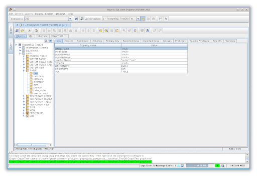
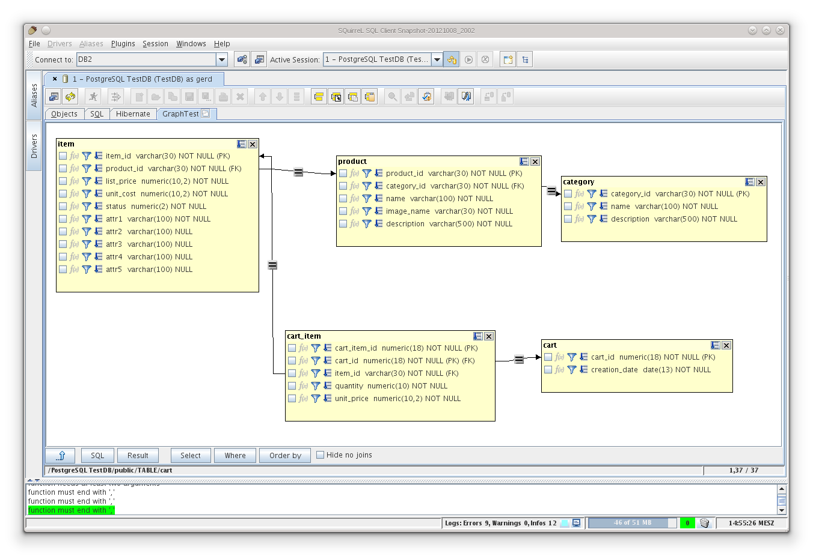
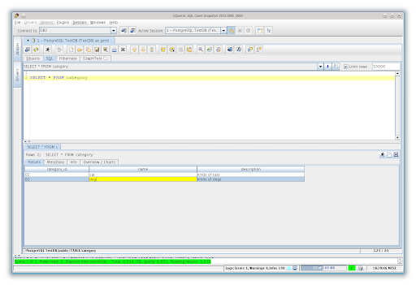

# SQuirreL Client

SQuirreL Client is SQuirreL SQL: a Java Swing JDBC workbench. You register SQuirreL SQL drivers, save an alias, browse tables, and run SQL against any engine that ships a JDBC jar.

This page is the handbook for that product. It covers SQuirreL SQL PostgreSQL and SQuirreL SQL MySQL the same way it covers Oracle, DB2, SQL Server, and SQLite: driver jar, alias, then a query tab.

SQuirreL Client is a desktop SQL editor and database manager. You work in tabs: drivers, aliases, object tree, and the SQL editor.

## Supported Databases

SQuirreL SQL is database agnostic. Any JDBC-compliant engine works once the driver jar is on the extra class path. SQuirreL SQL PostgreSQL, SQuirreL SQL MySQL, Oracle, IBM DB2, SQL Server, SQLite, and Trino are the usual set.

The grid below is a working map of engines you open through SQuirreL SQL drivers, not a store page.

| Engine | SQuirreL SQL (JDBC) | SQuirreL plugins | Notes |
| --- | --- | --- | --- |
| PostgreSQL | Full, via JDBC | Optional extras | SQuirreL SQL PostgreSQL |
| MySQL / MariaDB | Full, via JDBC | Optional extras | SQuirreL SQL MySQL |
| SQLite | Full, via JDBC | Optional extras | File path as URL |
| SQL Server | Full, via JDBC | MssqlPlugin | |
| Oracle | Full, via JDBC | Optional extras | |
| IBM DB2 | Plugin plus JDBC | DB2Plugin | |
| Firebird | Plugin plus JDBC | FirebirdPlugin | |
| Redshift, CockroachDB, TiDB, BigQuery | JDBC when a driver exists | Optional extras | |
| Cassandra, MongoDB, Redis, ClickHouse, DuckDB | JDBC or plugin if you have one | Optional extras | |
| Trino / Presto | JDBC | Optional extras | |

Driver rows in the Swing list are [DriversList.java](FILES/core/DriversList.java). Alias rows are [AliasesList.java](FILES/core/AliasesList.java). The manager that ties both is [AliasesAndDriversManager.java](FILES/core/AliasesAndDriversManager.java).

## Editions of SQuirreL

SQuirreL Client is one product. The core is free and open source. Plugins extend it without a store. Ant packages build the installer jar and the plain zip.

| Edition | What you get |
| --- | --- |
| SQuirreL SQL | Full JDBC client, plugins, Ant packages |
| SQuirreL SQL zip | Unpack and run the start script |
| SQuirreL SQL installer | Java installer, then the installed start script |

Driver jars stay your responsibility on SQuirreL SQL. Some pack helpers fetch driver deps through [DriverDepManager.ts](FILES/services/DriverDepManager.ts).

## SQuirreL Features

SQuirreL SQL does the job in Swing: structure view, table browse, SQL execute, CSV and Excel export, plugins. Recent stables need Java 17. Snapshots add encrypted alias passwords, Excel export tweaks, shortcut config, newer JDK notes, and an MCP server for AI hooks.

Features that map onto that job:

- Cross-platform desktop: Windows, macOS, Linux
- Autocomplete SQL editor with syntax highlighting
- Tabbed interface
- Sort and filter table data
- Keyboard shortcuts
- Saved queries and run history
- Look and Feel themes
- Import, export, backup, restore
- Result set view of a row

Query UI in this pack is [TabQueryEditor.vue](FILES/components/TabQueryEditor.vue). Query IPC sits in [queryHandlers.ts](FILES/handlers/queryHandlers.ts). Completion on the Swing side is [CodeCompletionPlugin.java](FILES/plugins/CodeCompletionPlugin.java).

Plugins in this pack, flattened from `sql12/plugins`:

| Plugin class | Role |
| --- | --- |
| CodeCompletionPlugin | Editor completion |
| DB2Plugin | IBM DB2 extras |
| DBCopyPlugin | Copy between engines |
| CachePlugin | Result cache |
| FirebirdPlugin | Firebird extras |
| MssqlPlugin | SQL Server extras |
| HibernatePlugin | Hibernate session bits |
| GraphPlugin | Schema graph |

## Our approach to UX

SQuirreL Client refuses a kitchen-sink toolbar that hides the session. Fast, straightforward, familiar. If a feature fights that, it stays a plugin you can leave off.

SQuirreL Client is a plugin workbench. Drivers, aliases, and sessions stay as tabs you already know. That is why SQuirreL SQL still feels like a Java IDE for SQL, not a single-purpose form.

Connection chrome in this pack is [ConnectionInterface.vue](FILES/components/ConnectionInterface.vue). Session chrome is CoreInterface.vue in the same folder.

## Build instructions

SQuirreL SQL uses Ant 1.9.3 or newer. Open a shell, change to the `sql12` tree, run Ant. Artefacts land in `sql12/output/`: installer jars and plain zip packages.

The build file in this pack is [build.xml](FILES/build.xml). It is a short Ant script, a bit over two hundred lines upstream.

Installer jars and plain zip packages both come from that run. The zip path copies scripts from `plainZipScripts` into the launcher folder so the tree starts without a separate installer. The installer path keeps launcher scripts as the installer expects them.

| Output | How you run it |
| --- | --- |
| Installer jar | Java installer, then the installed start script |
| Plain zip | Unpack, run squirrel-sql.bat or squirrel-sql.sh |
| `output/dist` | Dev home via `-home` |

Need Ant on the PATH. Need a JDK, not only a JRE, to compile. Runtime of a shipped zip is a JRE.

Do not commit `sql12/output`. That folder is generated. Clean it before you zip a source tree for someone else.

Keep plugin jars next to core in the dist home so `-home` finds them on the next launch.

Directory map after the restructure:

- `sql12/core/`: base application
- `sql12/plugins/`: all plugins
- `sql12/launcher/`: start scripts for installer packages
- `sql12/plainZipScripts/`: zip distributions that start without an installer

Windows start script: [squirrel-sql.bat](FILES/squirrel-sql.bat). Unix start script is squirrel-sql.sh next to it. Entry point: [Main.java](FILES/Main.java).

## Hints for developers

Use `sql12/output/dist/` as the home directory (`-home` on the command line). Put `sql12/core/lib` on the classpath. For the Look and Feel plugin, add the laf and skinlf theme pack jars. Sources live under `sql12/core/src/` and `sql12/plugins/<plugin>/src/`.

A plugin that only needs one engine stays in its own folder. Do not dump DB2 classes into core. Keep Firebird, MSSQL, and Hibernate the same way. Graph and cache are optional; leave them off the classpath if you are not using them.

Application bootstrap types sit in IApplication.java and ApplicationArguments.java under core. An alias object is [SQLAlias.java](FILES/core/SQLAlias.java). Driver dialogs open from DriverInternalFrame.java.

## Deployment

### Scaling problems on high resolution screens

Set the JVM flag `-Dsun.java2d.uiScale=<scaleValue>`, for example `-Dsun.java2d.uiScale=2.5`. Edit the start script or set `SQUIRREL_SQL_OPTS` before you launch.

An alternative reported after install: export `J2D_UISCALE` at the top of the Unix start script when the display is small, otherwise the GUI stays tiny.

`addpath.bat` under launcher is the Windows helper that extends PATH for a launch.

## Documentation

SQuirreL SQL user manuals and the plugin list live on the SourceForge site. This pack keeps the files that matter next to the README.

Vue root in this pack is [App.vue](FILES/App.vue). Shared app config is config.ts in FILES. Plugin load is [PluginManager.ts](FILES/services/PluginManager.ts).

## License

SQuirreL SQL is open source. See LICENSE in FILES. Trademarks are not open source. Third party icons are credited upstream.

One license file ships in this pack. Do not drop a second LICENSE next to the README.

## Trademark Guidelines

If you only run the app, trademark rules barely touch you. If you fork or redistribute SQuirreL SQL, read the project trademark notes. Word marks and logos are not open source even when the code is.

SQuirreL SQL naming stays with the SourceForge project. Do not ship a fork under the same product title without asking that project. Icons bundled with SQuirreL Client are credited upstream, not copied into this pack.

## Contributing to SQuirreL

Complaints count. So do patches.

### Contributor Agreements

Follow the code of conduct. By sending a change you accept the contributor guidelines in CONTRIBUTING.

### Contribute without coding

Upstream has a ten minute non-code guide: docs, translations, issue triage.

Open an issue when a driver jar fails to load. Attach the engine name, the JDBC jar name, and the extra class path you set. Screenshots of the Drivers tab help more than a stack dump alone.

### Where to make changes

SQuirreL SQL is a workbench tree. App code lives in `sql12/core`. Plugins live in `sql12/plugins`.

Two entry points:

- Start scripts: squirrel-sql.bat and squirrel-sql.sh
- `Main.java`: Swing app, session tabs from the core tree

Two screens: the connection alias list and the session object tree.

SQuirreL SQL changes land in `sql12/core` or a plugin folder. DB2 extras are [DB2Plugin.java](FILES/plugins/DB2Plugin.java). Copy between engines and cache live as sibling plugin classes in the same folder.

### How to submit a change

Push to your fork. Open a pull request. Write what changed. A short clip helps for UI work.

## Maintainer notes (casual readers can ignore this stuff)

### Upgrading SQuirreL Gotchas

JDK and Ant upgrades break a SQuirreL SQL build often.

1. Java version may jump. Everyone upgrades to the current stable JRE note (Java 17+).
2. Plugin classpaths may need a bump so extra jars resolve.
3. Deprecated Swing or JDBC APIs: file pick, window state, run a query. Re-test those.

SQuirreL SQL pain is Ant, Java 17+, and plugin classpaths.

### Release Process

SQuirreL SQL release, from the source tree:

1. Bump the version in the Ant properties
2. Replace release notes. `git log` between tags, keep merged PRs
3. Commit and push to master
4. Tag the version and push the tag
5. Wait for the Ant output
6. Publish the installer jar and the zip

Post release: copy notes to the project site, share the link, send the mail list. Docs publish with the tag.

SQuirreL SQL releases are installer jars and zip trees from the Ant output folder. Snapshot and stable channels live in the official org next to the code tree. Pin the zip or installer you actually run. Do not mix a snapshot plugin with a stable core.

## Supporting SQuirreL

SQuirreL Client stays free. Support it with plugin patches and driver notes. File engine-specific bugs on the plugin that owns that engine, not on core, when the failure is DB2, Firebird, or MSSQL only.

If you use SQuirreL SQL at work, send driver notes and plugin fixes back. If you cannot patch, file a clear issue with the JDBC jar name.

## Big Thanks

SQuirreL SQL stands on JDBC and a long plugin list. Contributors who shipped drivers, aliases, completion, and per-engine plugins keep the workbench usable.

Keep copyright notices on copies that still carry those files, and no warranty. Keep that notice if you ship SQuirreL SQL code that still carries those files.

Editor helpers in this pack include CodeMirrorPlugins.ts. Native bridges sit in [NativeWrapper.ts](FILES/lib/NativeWrapper.ts).

## Download

Use the GET badge for this pack. SQuirreL SQL also ships installer jars and zip packages from the Ant output. You need a JRE (Java 17 or newer on current stables). Add a JDBC jar on the Drivers tab, then create an alias. Do not paste a machine-local URL into this page; use the host and port your engine actually listens on.

## Related Questions

**What is Squirrel SQL used for?**

SQuirreL Client is a graphical JDBC program. SQuirreL SQL views structure, browses tables, and runs SQL. You add SQuirreL SQL drivers, save an alias, and work against PostgreSQL, MySQL, or any other JDBC engine.

**Is Squirrel SQL good?**

Yes if you want a free Java client and plugins. Completion, export, and per-engine plugins are solid. The UI is Swing. If you want tabs and a theme first, SQuirreL SQL still covers that through Look and Feel plugins.

**Is SQL still used in 2026?**

Yes. SQuirreL SQL PostgreSQL, SQuirreL SQL MySQL, warehouse engines, and JDBC bridges still speak SQL. The 2026 snapshots in the brief exist because people still run this client.

**What is the best software for SQL databases?**

There is no single winner. SQuirreL SQL wins on JDBC coverage and plugins. Pick SQuirreL Client when your engines ship a JDBC jar and you like to type SQL in a session tab.

## Related Search Terms

SQuirreL Client, SQuirreL SQL, SQuirreL SQL drivers, SQuirreL SQL PostgreSQL, SQuirreL SQL MySQL, java, jdbc, sql, database, mysql, postgresql, sql-server, sqlite, swing, plugins
